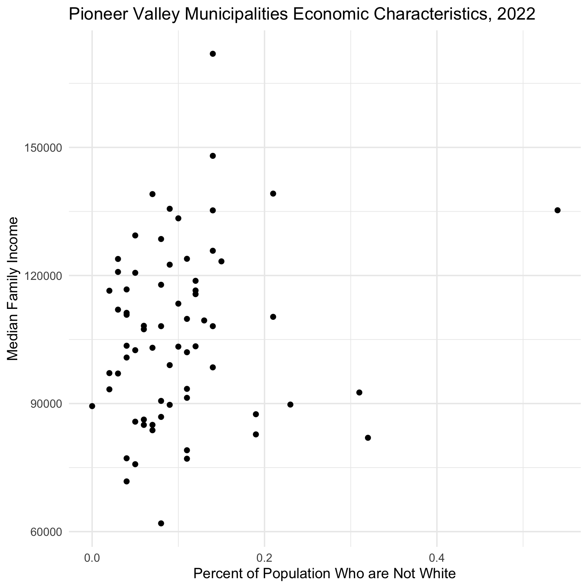
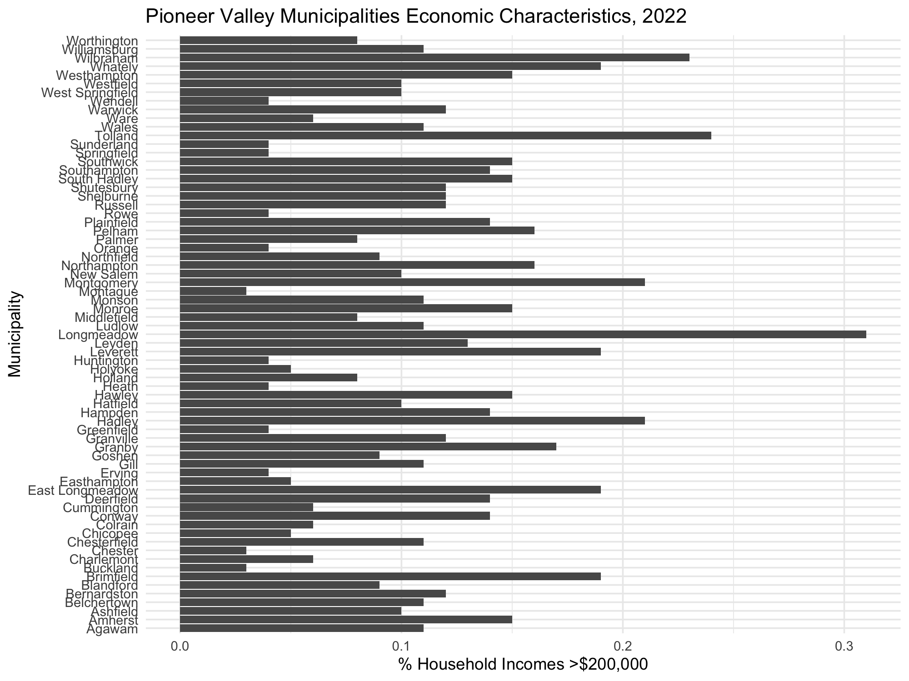
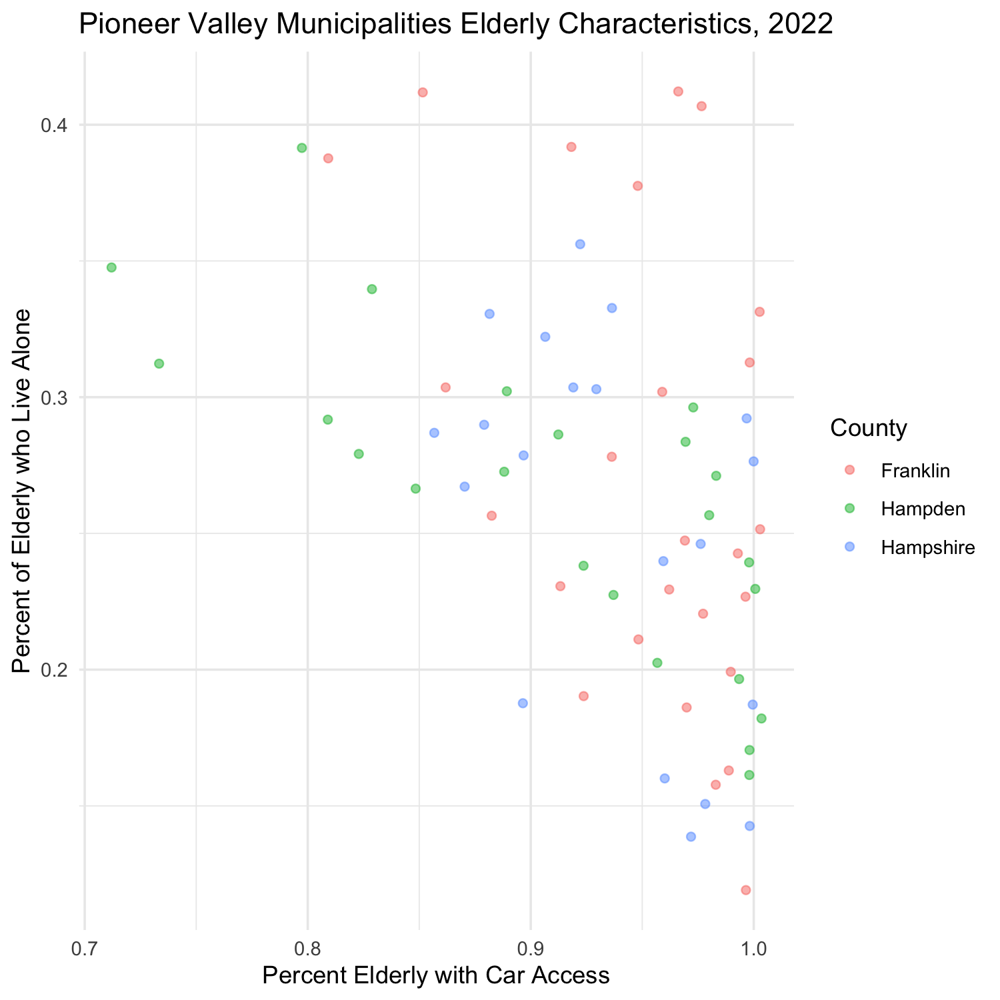

```{r}
#| message: false
#| warning: false
#| document: show

library(tidyverse)
pioneer_valley_census_data <- read_csv("https://raw.githubusercontent.com/SDS-192-Intro/public-website-fall-25/refs/heads/main/data/pioneer_valley_census_2022.csv")

pioneer_valley_census_data_dictionary <- pioneer_valley_census_data |> 
  select(VAR_CAT, VAR, VAR_NAME) |>
  distinct()

pioneer_valley_census_data <- pioneer_valley_census_data |>
  select(-VAR_CAT, -VAR) |>
  pivot_wider(names_from = VAR_NAME,
              values_from = VALUE) |>
  filter(LEVEL_CD_NAME != "Region")
  
hampshire_census_data <- pioneer_valley_census_data %>% 
  filter(COUNTY == "Hampshire")
```


```{r}
#Add practice code from lecture here.
```


###### Question

::: question

Check the column names for `pioneer_valley_census_data`. View what column names refer to via `pioneer_valley_census_data_dictionary`.

:::

```{r}
# Write code here
```

```{r}
#| document: solutions
#| echo: false

ggplot(data = pioneer_valley_census_data, 
       mapping = aes(x = MINORITY_PERCENT,
                     y = CEN_MEDFAMINC)) +
  geom_point(size = 0.5) +
  labs(title = "Pioneer Valley...",
       x = "Percent of Pop...",
       y = "Median Family Income") +
  theme_minimal()
```

###### Question

::: question
Recreate this image using the `ggplot()` function. 
:::



```{r}
#Code here.
```

```{r}
#| document: solutions
#| echo: false

ggplot(data = pioneer_valley_census_data, 
       mapping = aes(x = COMMUNITY,
                     y = CEN_PERC_HHINC_200000_PLUS)) +
  geom_col() +
  coord_flip() +
  labs(title = "Pioneer Valley...",
       x = "Municipality",
       y = "% Household Income...") +
  theme_minimal()
```

###### Question

::: question

Recreate this image using the `ggplot()` function. 
:::



```{r}
#Code here.
```

```{r}
#| document: solutions
#| echo: false

ggplot(data = pioneer_valley_census_data, 
       mapping = aes(x = COMMUNITY,
                     y = CEN_PERC_HHINC_200000_PLUS)) +
  geom_col() +
  coord_flip() +
  labs(title = "Pioneer Valley...",
       x = "Municipality",
       y = "% Household Income...") +
  theme_minimal()
```

###### Question

::: question
Recreate this image using the `ggplot()` function. 
:::



```{r}
#Code here.
```

```{r}
#| document: solutions
#| echo: false

ggplot(data = pioneer_valley_census_data, 
       mapping = aes(x = CAR_AGE_HOUSEHOLDER,
                     y = ELDERLY_LIVEALONE,
                     col = COUNTY)) +
  geom_point(alpha = 0.5) +
  labs(title = "Pioneer Valley...",
       x = "% Elderly...",
       y = "% Elderly...",
       col = "County") +
  theme_minimal()
```

###### Question

::: question
Which of the following does each point on this plot indicate?

A person

A municipality

A commute

A county

:::


