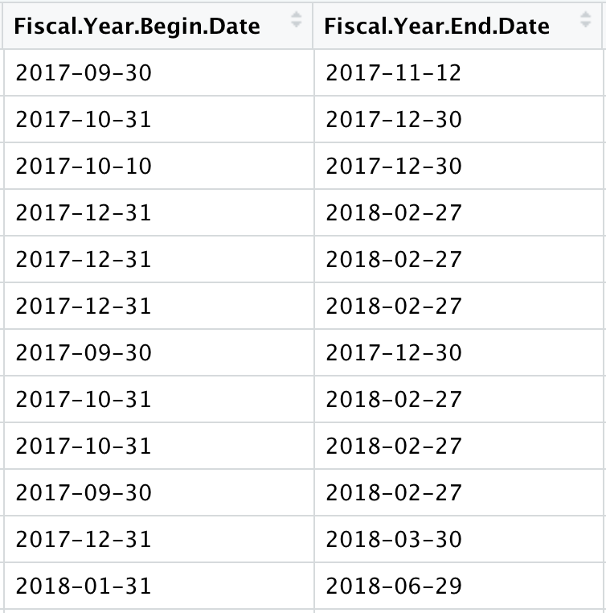
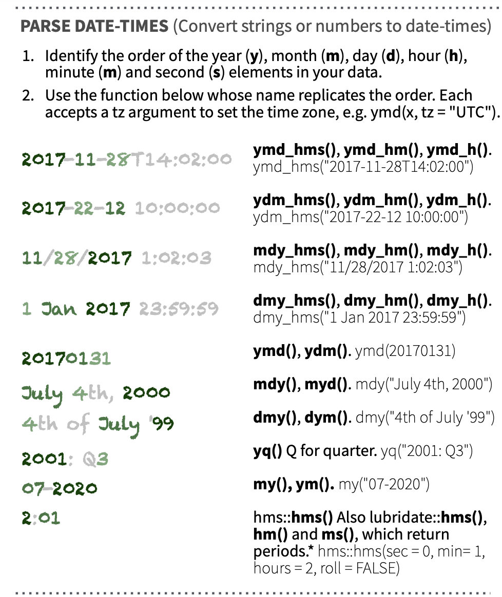

## For Today

-   Mutating to reformat vectors
-   Working with NA columns
-   Practice cleaning a dataset


-------


```{r}
#| echo: false
library(tidyverse)
library(tidyverse)
library(echor)
library(DT)

#frs <- read.csv("../data/frs.csv")

echo_air_ca <- 
  echoAirGetFacilityInfo(p_st = "CA", 
                         qcolumns = "1,3,4,5,7,8,15,22,107,108,109,110") |>
  select(-SourceID)

```

------------------------------------------------------------------------

# Whenever formatting columns, we will use `mutate` to overwrite a variable with a new cleaned up variable. 

------------------------------------------------------------------------

```{r}
library(tidyverse)
prisons <- read_csv("../data/Prison_Boundaries.csv")
```


------------------------------------------------------------------------

## Converting Types

- `as.character()`, `as.numeric()`, `as.logical()` all convert a variable from an original type to a new type

::: panel-tabset
### Before

```{r}
typeof(prisons$COUNTYFIPS)
```

### Code

```{r}
prisons <- 
  prisons |> 
  mutate(COUNTYFIPS = as.numeric(COUNTYFIPS))
```

### After

```{r}
typeof(prisons$COUNTYFIPS)
```


:::

------------------------------------------------------------------------

## Parsing Dates

-   Dates can be converted to a date format using the `lubridate` package
    -   Step 1: Check how dates are formatted
    -   Step 2: Find corresponding conversion code on `lubridate` cheatsheet

::: columns
::: {.column width="50%"}

 

:::

::: {.column width="50%"}



:::
:::
------------------------------------------------------------------------


## Setting Dates

-   `ymd_hms()` will take a date formatted as year, month, day, hour, minute, second and convert it to a date time format

::: panel-tabset
### Before

```{r}
prisons |> 
  select(NAME, SOURCEDATE) |> 
  head(3)
```

### Code

```{r}
library(lubridate)

prisons <- 
  prisons |> 
  mutate(SOURCEDATE = ymd_hms(SOURCEDATE))
```

### After

```{r echo=FALSE}
prisons |> 
  select(NAME, SOURCEDATE) |> 
  head(3)
```

:::

------------------------------------------------------------------------


## Setting `NA` values

- `na_if()` will take a variable and set specified values to `NA`

::: panel-tabset
### Before

```{r}
prisons |> 
  select(NAME, POPULATION) |> 
  head(3)

sum(is.na(prisons$POPULATION))
```

### Code

```{r}
prisons <- 
  prisons |> 
  mutate(POPULATION = na_if(POPULATION, -999))
```

### After

```{r}
prisons |> 
  select(NAME, POPULATION) |> 
  head(3)

sum(is.na(prisons$POPULATION))
```

:::

------------------------------------------------------------------------


## Replacing Strings

- `str_replace()` will take a variable and replace an *existing* string with a *new* string

::: panel-tabset
### Before

```{r}
prisons |> 
  select(NAME, ADDRESS) |> 
  head(3)
```

### Code

```{r}
prisons <- 
  prisons |> 
  mutate(ADDRESS = str_replace(ADDRESS, 
                               "DR", 
                               "DRIVE"))
```

### After

```{r echo=FALSE}
prisons |> 
  select(NAME, ADDRESS) |> 
  head(3)
```

:::


------------------------------------------------------------------------

## Removing Strings

- `str_replace()` will take a variable and replace an *existing* string with a *new* string

::: panel-tabset
### Before

```{r}
prisons |> select(NAME, WEBSITE) |> head(3)
```

### Code

```{r}
prisons <- 
  prisons |> 
  mutate(WEBSITE = str_replace(WEBSITE, 
                               "http://", 
                               ""))
```

### After

```{r echo=FALSE}
prisons |> 
  select(NAME, WEBSITE) |> 
  head(3)
```

:::

------------------------------------------------------------------------

## Conditionals

-   `case_when()` allows us to set values when conditions are met

::: panel-tabset
### Before

```{r}
prisons |> 
  select(SECURELVL) |> 
  distinct()
```

### Code

```{r}
prisons <- 
  prisons |> 
  mutate(JUVENILE = 
           case_when(
             SECURELVL == "JUVENILE" ~ "Juvenile",
             TRUE ~ "Not Juvenile")) 
```

### After

```{r echo=FALSE}

prisons <- 
  prisons |> 
  mutate(SECURELVL = 
           case_when(
             SECURELVL == "JUVENILE" ~ "Juvenile",
             SECURELVL == "NOT AVAILABLE" ~ "NOT AVAILABLE", 
             TRUE ~ "Not Juvenile")) 

prisons |> 
  select(NAME, SECURELVL, JUVENILE) |> 
  head(10)
```

:::

--------

## Identifying Prisons in ECHO

