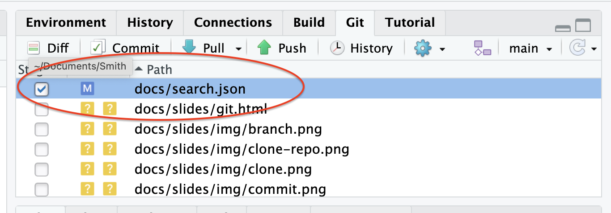
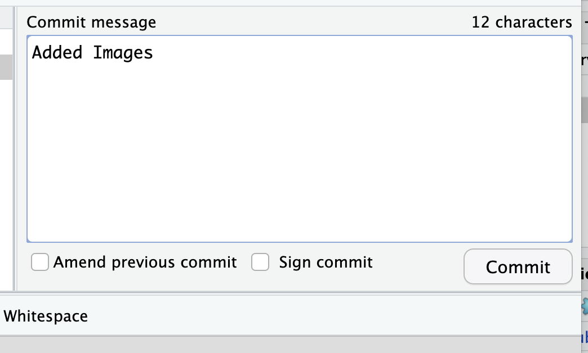
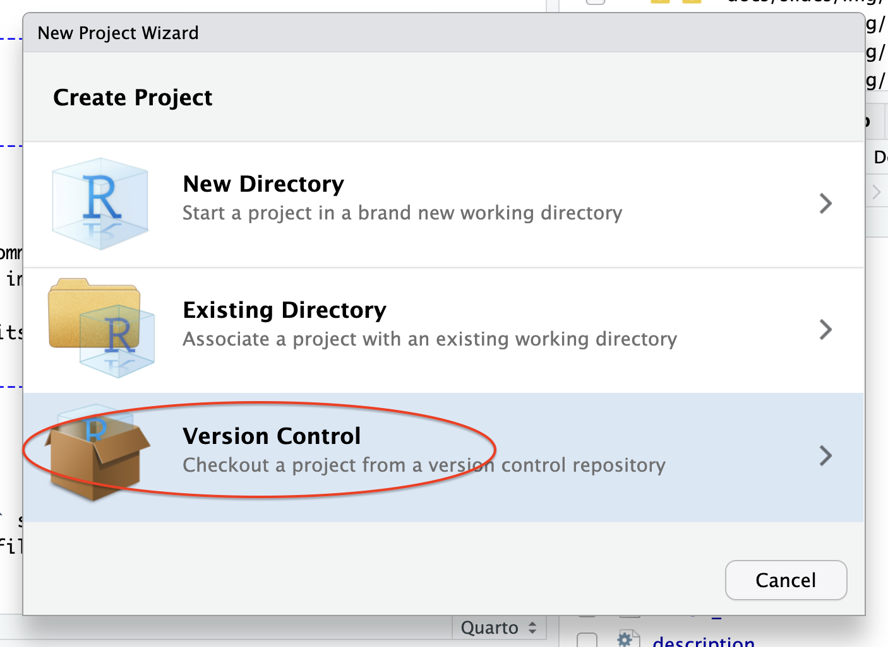
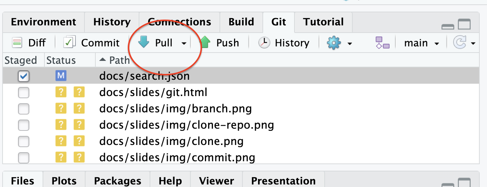
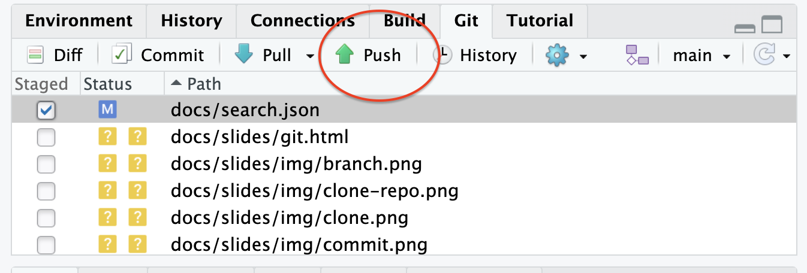
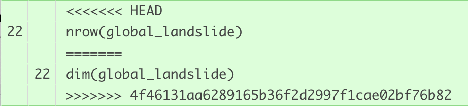
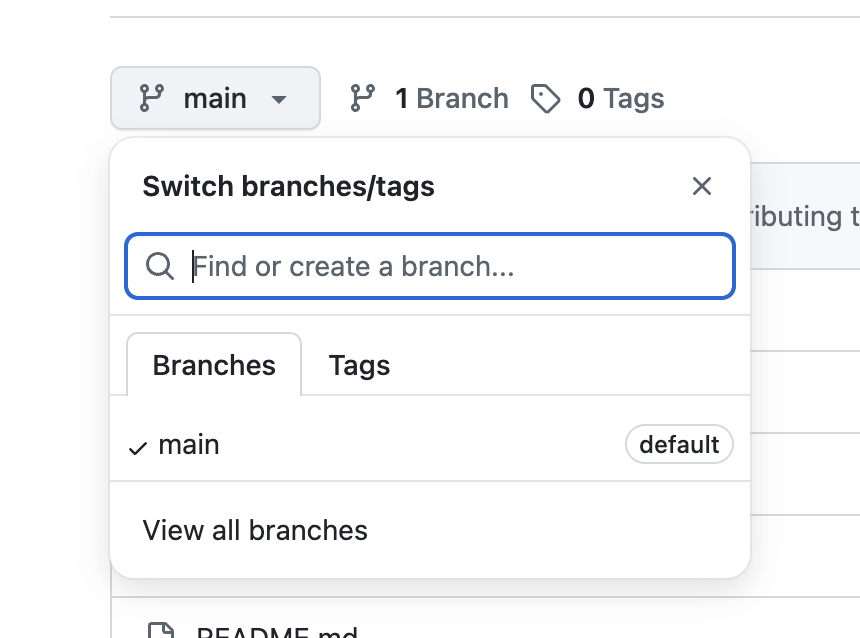
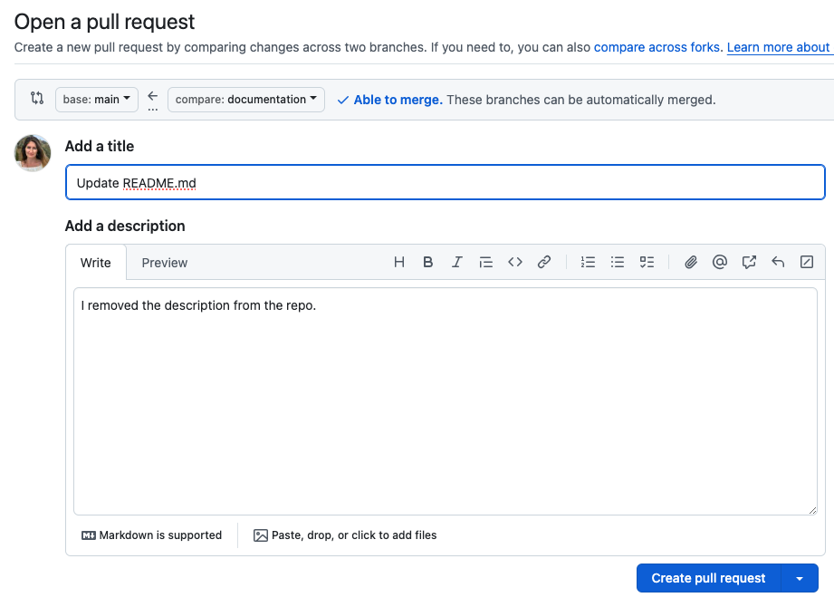

## For Today

-   Introduction to git/GitHub
-   Practice with remote repository

------------------------------------------------------------------------

## What is version control?

-   a process of recording and organizing a history of changes to files within a project
-   enables a software developer to compare or return to previous versions of files
-   enables a software team to pinpoint which changes led to issues in their coding project

------------------------------------------------------------------------

## What is git?

-   a version control system that supports collaborative software projects
-   enables a software team to synchronize changes to files that are being made in many different places

------------------------------------------------------------------------

## What is GitHub?

-   a hosting site for `git` projects
-   stores `git` projects on the cloud, allowing others to view and make edits to code according to permissions you grant

------------------------------------------------------------------------

## What is a repository?

-   a data structure for version control systems
-   stores metadata recording the history of changes for a particular set of files
-   will look like a regular folder on your computer since the metadata is often stored in hidden files

------------------------------------------------------------------------

# Part One: Local git commands

------------------------------------------------------------------------

## Staging Files

::: columns
::: {.column width="50%"}

- **Staging** involves *selecting* which revised files to record in the version history.

:::

::: {.column width="50%"}

:::
:::

------------------------------------------------------------------------

## Committing Files

::: columns
::: {.column width="50%"}

- **Committing** actually records the revisions in the version history.
  - Any time you commit, you will write a commit message, summarizing the changes. Messages should be *descriptive* and *concise*.
:::

::: {.column width="50%"}

:::
:::

------------------------------------------------------------------------

# Part Two: Working Locally and Remotely

------------------------------------------------------------------------

## Cloning a Repository

::: columns
::: {.column width="50%"}

- **Cloning** involves copying a repository from a remote source locally or vice versa.

:::

::: {.column width="50%"}

:::
:::

------------------------------------------------------------------------

## Pulling Changes

::: columns
::: {.column width="50%"}

- **Pulling** involves bringing changes made to a remote repository locally.

:::

::: {.column width="50%"}

:::
:::

------------------------------------------------------------------------

## Pushing Changes

::: columns
::: {.column width="50%"}

- **Pushing** involves sending changes made to a local repository remotely.

:::

::: {.column width="50%"}

:::
:::

------------------------------------------------------------------------

# Part Three: Conflicts!

------------------------------------------------------------------------

## Push Error

::: columns
::: {.column width="50%"}

- A push error occurs when we make changes to files on our local machines, and go to commit and push them to GitHub.com, but other changes had already been made to the file at GitHub.com that were not yet pulled into our local environments.

:::

::: {.column width="50%"}

> The Fix: Pull changes to local machine, and try committing and pushing again

:::
:::

------------------------------------------------------------------------

## Pull Error

::: columns
::: {.column width="50%"}

- A pull error occurs when changes have already been made to the same location (the same line number) in both a remote file and a local file, and then we try to pull the changes from the remote repo to our local machines. 

:::

::: {.column width="50%"}

> The Fix: Stage and commit your local changes and then try pulling again

:::
:::

------------------------------------------------------------------------

## Merge Conflict

::: columns
::: {.column width="50%"}

- A merge conflict often occurs following a pull error. It occurs when two people are working on the same file, and they commit changes that are in conflict with one another. 

:::

::: {.column width="50%"}

> The Fix: Open the file with conflicts and edit the lines with conflict. Decide what that line should look like and delete all other content. This means you must delete “<<<<<<< HEAD”, “=======”, and “>>>>>>> <long-hash>”, and you likely should delete at least one other line. 

:::
:::

------------------------------------------------------------------------

# Part Four: Mitigating Conflicts

------------------------------------------------------------------------

## Branching

::: columns
::: {.column width="50%"}

- **Branching** involves creating a copy of a repo specifically for editing. You can make changes to files while maintaining a stable copy of the original.

:::

::: {.column width="50%"}

:::
:::

------------------------------------------------------------------------

## Pull Requests

::: columns
::: {.column width="50%"}

- **Pull requests** are requests to bring the changes made in a branch of the project into another branch of the project (such as the original). 
  - Collaborators can make requests and review the changes before approving the request.

:::

::: {.column width="50%"}

:::
:::

------------------------------------------------------------------------

## Merging

- **Merging** involves approving the changes requested via a pull request and ultimately bringing the changes made in a different branch into the current branch.

------------------------------------------------------------------------

# Part Five: Other Important Information

------------------------------------------------------------------------

## History

-   Via `git` you can track every commit. 
-   Descriptive commit messages are important so that you know which commits you are looking at.
-   You can revert to previous commits if necessary.

------------------------------------------------------------------------

## `.gitignore`

-   This file lists files that `git` should not track.
-   Important for preventing large files and passwords from being sent to GitHub.com.

------------------------------------------------------------------------

## What if I don’t have permissions to edit or push to a GitHub repository? 

-   This is when you want to fork a repository instead of branching it. Forking a repository creates a copy of a repo in your account. 
-   You can make changes just like you would in a branch, but you cannot push to the master. Instead, you can create a pull request to the repo’s owners, which they can review before merging your changes into master. 
-   If you want to keep your fork up-to-date with the original repo, you will need to rebase it. 